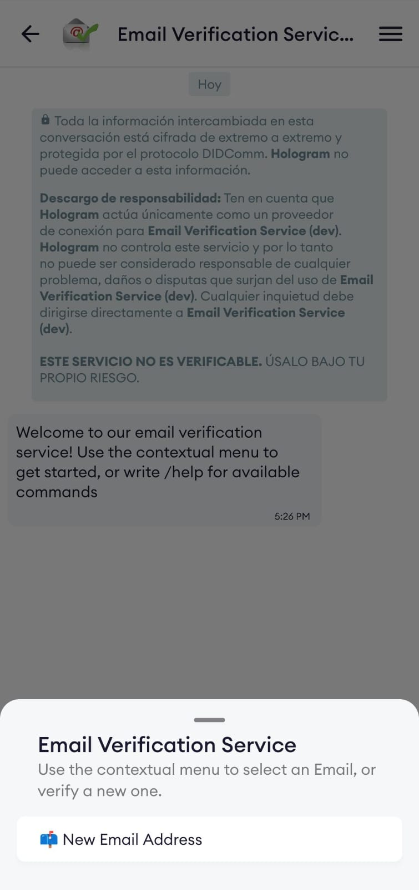
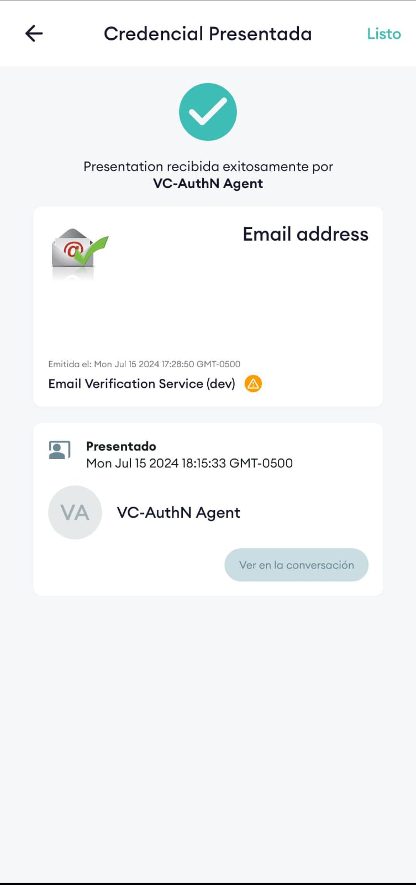

# 2060 Demo Guide for Verifiable Credential Authentication with OpenID Connect (VC-AuthN OIDC)


Verifiable Credential Identity Provider for OpenID Connect. This is an implementation of the [verifiable credential](https://github.com/bcgov/vc-authn-oidc) system for [2060.](https://2060.io/)

## Purpose of the demo
This is a demo for deploying an authentication system with Keycloak using an identity provider. The complete system will allow validation of any credential created for the purpose of enabling authentication and thus permitting access to any required system.

Using a vc auth system for issuing Verifiable Credentials has many benefits:

- **security**: For years, there has been a quest for an identity control method for authenticating users, sensitive data, and other transactions. This implementation aims to achieve an approach to the world envisioned for 2060, providing verifiable credentials that ensure the identity of the credential holder.

A conversational DIDComm service is probably **the most secure way of delivering Verifiable Credentials**.

hen, as soon as you've got you Verifiable Credential, you can use it to identify yourself and access passwordless services.

## Device lost, app uninstalled?

If you loose you cellphone or delete the App, then can restore your Identity by simply re-connecting to the same Registry service, verifying your face, and recover your Verifiable Credential.

## Pre-requisites
- A bash-compatible shell such as [Git Bash](https://git-scm.com/downloads)
- [Docker](https://docs.docker.com/get-docker/)
- Ngrok token (optional, required for local development)
- [Kubernetes](https://kubernetes.io/docs/setup/) (for deployment)

## Try the demo(s)
In this initial demo, we will first approach a deployment in a local environment to validate some of the behaviors that the VC Auth system manages for presenting verifiable credentials generated by 2060
**Note**: Please keep in mind that this is an adaptation of the [VC Auth project](https://github.com/bcgov/vc-authn-oidc), which includes a wide range of configurable options and customizations as desired. Detailed information regarding its configuration can be found within the project itself.

### Setup environment
#### Configuring Ngrok

Each developer must apply for an Ngrok token [here](https://dashboard.ngrok.com/get-started/your-authtoken). Then place the token into the .env-dev file within the docker directory.

```
NGROK_AUTHTOKEN=<your token here>
```

#### Running VC-AuthN

Open a shell in the [docker](docker-dev/) folder and run the following commands:

- `./manage start`: this will start the project. Follow the script prompts to select the appropriate runtime options: they will be saved in an `env` file for the next execution.
- `./manage example`: this will create the example values ​​in the controller for the example use.
**Note**:By default, you don't need to execute this command as the example will create the necessary default values. If you want to customize the credentials, you can edit the init-mongo.sh file and then execute the command `./manage example`.
- To reset everything (including removing container data and selected options in the `env` file) execute `./manage rm`.

A list of all available commands is visible by executing `./manage -h`.

#### Using VC-AuthN
<!-- To use VC-AuthN for development and/or demo purposes, a pre-configured demo app is provided in the [demo/vue](demo/vue/) folder. To start it, execute `docker compose up` from within the `demo/vue` folder. -->

In order to use the VC OIDC authentication, a couple of extra steps are required:

**Note**: If you wish to use the default example for quick deployment purposes, please note that you can skip this step by running the `./manage example` command. This will generate the necessary values for proper usage and deployment of this demo. Alternatively, if you prefer to customize the credential to be used and set up your own, please refer to the [following information](https://github.com/bcgov/vc-authn-oidc?tab=readme-ov-file#using-vc-authn).

#### Description of parameters for customization 

| Name                            | Description                                                                                                                               | Value   |
| ------------------------------- | ----------------------------------------------------------------------------------------------------------------------------------------- | ------- |
| `ver_config_id`                 | String value responsible for identifying the variable `pres_req_conf_id`, which is sent from the frontend to identify the configuration to apply | `email` |
| `subject_identifier`            | See [here](https://github.com/bcgov/vc-authn-oidc/tree/main/docs#subject-identifer-mapping) for further details.                          |         |
| `include_v1_attributes`         | Optional field defaulting to false. Boolean value responsible for enabling the independent sending of credential                          |         |
| `generate_consistent_identifier`| See [here](https://github.com/bcgov/vc-authn-oidc/tree/main/docs#subject-identifer-mapping) for further details.                          |         |
| `requested_credentials`         | Contains the details on the presentation request                                                                                          |         |
| `credentialDefinitionId`        | It contains the ID of the credential required for authentication                                                                          |         |
| `attributes`                    | This is an array containing all the attributes required for the given credential                                                          |         |

### Setup Keycloak theme
In this exercise, we are utilizing the theme proposed for Keycloak by 2060. It is crucial to ensure that the appropriate parameters are set in Keycloak's environment variables. Two parameters are provided for its proper functioning: the first one, `KC_HOLOGRAM` (recommended), enables the system to detect the associated identity provider for 2060. Additionally, there is an optional parameter named `KC_HOLOGRAM_AUTH` (optional), which allows us to specify the authentication behavior of the identity provider. This parameter is useful in scenarios where disabling email or VC auth might be required, or simply allowing the normal flow if this is not necessary.
Suggested default values:
- KC_HOLOGRAM: "vc-authn"
- KC_HOLOGRAM_AUTH: ""

For more information regarding the possible configuration states, please refer to the project [2060-auth-theme](https://github.com/2060-io/auth-2060-theme/tree/main?tab=readme-ov-file#environment-variables)

### Get Chatdemo Credential

Demo service for 2060 testing.

#### Scan the QR code

Click the link for chatbot demo.


#### Accept the Invitation
<kbd>

</kbd>

#### Create the Credential

Go to contextual menu, select `New Email Address` and complete the process by `accept` the offered credential.

<kbd>


</kbd>

### Frontend used
The frontend employed is an example available in [2060](https://github.com/2060-io/dashboard-frontend/tree/dev) for the proper implementation and validation of the system. It is important to bear in mind that the frontend dashboard is designed to manage a service deployment in 2060 that is under construction

Finally, to start enjoying the demo, it's important to go to the following URL and click on the `Log In` button to validate the use of the authentication system provided in this demo.
```bash
http://localhost:8080/
```
<kbd>


</kbd>

Once the selected authentication method is QR validation, you should go to the `Scan` section presented in the app. This will allow the QR code to be scanned and validated to verify the user's credential. Keep in mind that the system allows you to select from various credentials that meet the required criteria if you have more than one credential.

<kbd>


</kbd>

The process will continue on the website where you are authenticating. The system will prompt you to complete the user creation details. In this case, it will automatically retrieve data from the credential to populate the system, and you will only need to fill in the fields for your `first name` and `last name`

<kbd>


</kbd>

Finally, you can validate the created user by accessing Keycloak using the URL `http://localhost:8880/auth/`. There, you can log into the system using the appropriate authentication credentials (by default, `admin` is configured for both `username` and `password`). Select the realm `vc-atuhn`, and under the user section, you will be able to observe the newly created user.

<kbd>


</kbd>